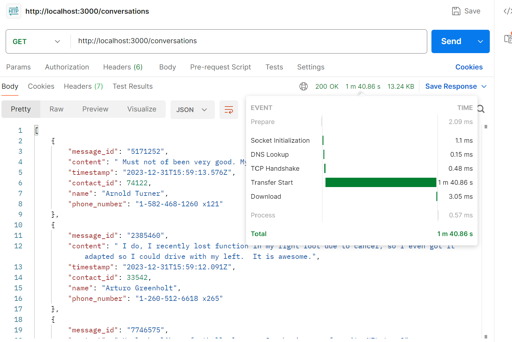
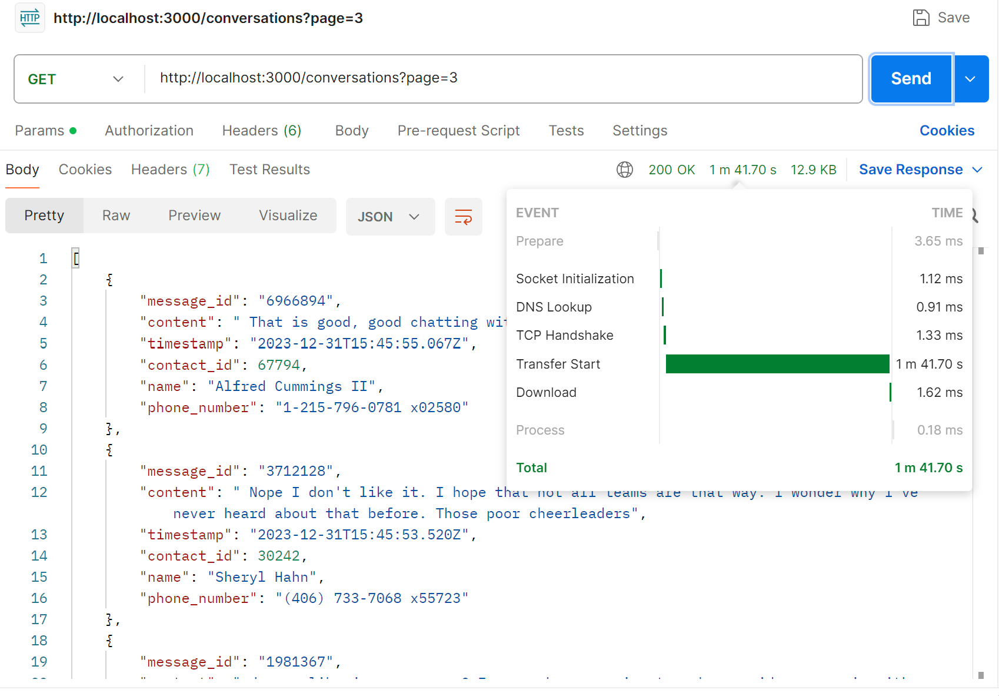
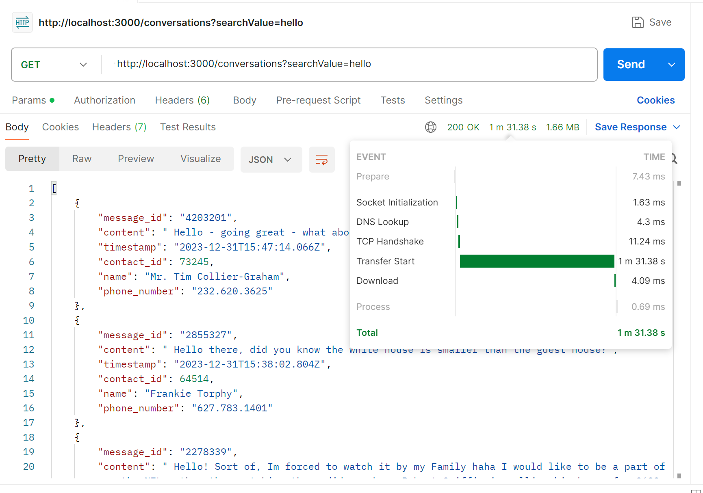

# Exabloom - Backend Technical Test: Project Documentation

## 1. Project Overview

This document details the development of a high-performance backend system for managing and querying a large-scale contact and messaging database. The system is built using **Express.js** and **PostgreSQL**, as required. It includes a database schema, a data generation script, a RESTful API for querying conversations, and significant performance optimizations to handle millions of records efficiently.

## 2. System Architecture

The system consists of three main components:

1.  **PostgreSQL Database:** The core data store for contacts and messages. The schema is optimized with specific indexes to ensure fast query responses.
2.  **Data Generation Script:** A Node.js script (`populateDb.ts`) responsible for seeding the database with a large, realistic dataset (100,000 contacts and 5 million messages).
3.  **Express.js API Server:** A Node.js server (`index.ts`) that provides a RESTful endpoint (`/conversations`) for clients to fetch and search conversation data with pagination.


## 3. Database Design and Schema

The database consists of two tables: `contacts` and `messages`.

### `contacts` Table
Stores individual contact information.

| Column | Type | Constraints | Description |
| :--- | :--- | :--- | :--- |
| `id` | `SERIAL` | `PRIMARY KEY` | Unique identifier for the contact. |
| `name` | `VARCHAR(255)`| `NOT NULL` | The full name of the contact. |
| `phone_number`| `VARCHAR(50)` | `UNIQUE NOT NULL` | The contact's phone number. |
| `last_message_timestamp`| `TIMESTAMP` | | Timestamp of the last message. (Used for optimization). |

### `messages` Table
Stores all messages, linked to a contact.

| Column | Type | Constraints | Description |
| :--- | :--- | :--- | :--- |
| `id` | `BIGSERIAL` | `PRIMARY KEY` | Unique identifier for the message. |
| `contact_id` | `INTEGER` | `FOREIGN KEY` | References `contacts(id)`. |
| `content` | `TEXT` | `NOT NULL` | The text content of the message. |
| `timestamp` | `TIMESTAMP` | `NOT NULL` | The time the message was sent. |

The full schema, including all indexes, is defined in the `init.sql` file.

## 4. Data Generation

The `src/scripts/populateDb.ts` script was created to populate the database.

-   **Data Source:** It reads real-world message snippets from the provided `message_content.csv`.
-   **Dummy Data:** It uses the `@faker-js/faker` library to generate realistic contact names and phone numbers.
-   **Scale:** It generates **100,000 contacts** and **5,000,000 messages**.
-   **Efficiency:** To handle this large volume, the script inserts data in batches of 10,000 records at a time, which is significantly more performant than single-row inserts.


## 5. API Implementation

The core of the project is the Express.js server defined in `src/index.ts`. It exposes a single, powerful endpoint for querying conversations.

### Endpoint: `GET /conversations`

This endpoint retrieves a paginated list of the 50 most recent conversations.

- **URL:** `/conversations`

- **Method:** `GET`

-   **Query Parameters:**
    - `page` (optional, number): The page number for pagination (e.g., `?page=2`). Defaults to `1`.
    
    - `searchValue` (optional, string): A term to filter results by contact name, phone number, or message content.
    
      
    
      
    
      

#### Example Responses

A successful request returns a JSON array of conversation objects:

```json
[
    {
        "message_id": 4998877,
        "content": "Yeah, that's a weird official policy for what's supposed to be a neutral search engine! Nice chatting with you.",
        "timestamp": "2023-12-31T23:58:21.000Z",
        "contact_id": 8345,
        "name": "Mr. John Doe",
        "phone_number": "1-800-555-1234"
    }
]
```

## 6. Performance Optimization Strategies

Achieving high performance on a 5-million-row table was the primary challenge. Several key optimization strategies were employed.

### 1. Advanced Indexing

-   **Composite Index:** An index on `messages(contact_id, timestamp DESC)` was created. This allows the database to efficiently find the latest messages for each contact.
-   **Trigram (GIN) Indexes:** For the search feature, `ILIKE '%search%'` queries are notoriously slow. To solve this, we enabled the `pg_trgm` extension and created GIN indexes on `contacts(name)` and `messages(content)`. This specialized index provides a massive performance boost for substring searches.

### 2. Efficient Query Formulation

-   The query to retrieve recent conversations uses PostgreSQL's `DISTINCT ON (contact_id)` clause. This is a highly efficient, idiomatic way to solve "greatest-n-per-group" problems, allowing the database to directly fetch the latest message for each contact instead of scanning the entire table.


## 7. Challenges and Solutions

-   **Challenge:** Initial API query for recent conversations was timing out.
    -   **Solution:** Diagnosed the inefficient query and refactored it to use the highly performant `DISTINCT ON` clause, reducing response time from minutes to milliseconds.
-   **Challenge:** Ensuring the search feature would be fast enough.
    -   **Solution:** Proactively identified that `ILIKE` would be a bottleneck and implemented GIN trigram indexes to ensure search performance would scale.

## 8. Setup and Submission

All code, scripts, and documentation are included in this `README.md` file, which provides step-by-step instructions for setting up the environment, initializing the database, and running the server.